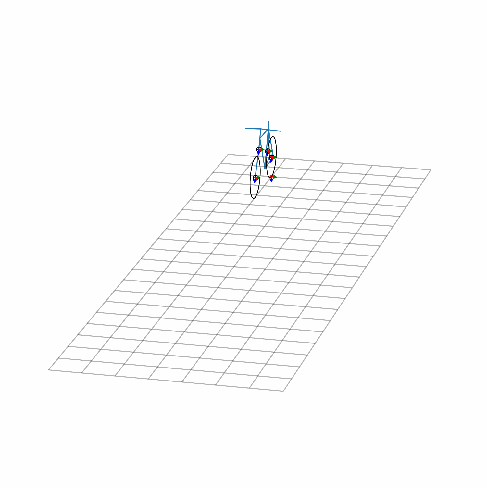

# Simulating a Whipple Bicycle Model
The model presented here creates the Whipple bicycle model following
[Moore's parametrization convention].

[Moore's parametrization convention]: http://moorepants.github.io/dissertation/eom.html
