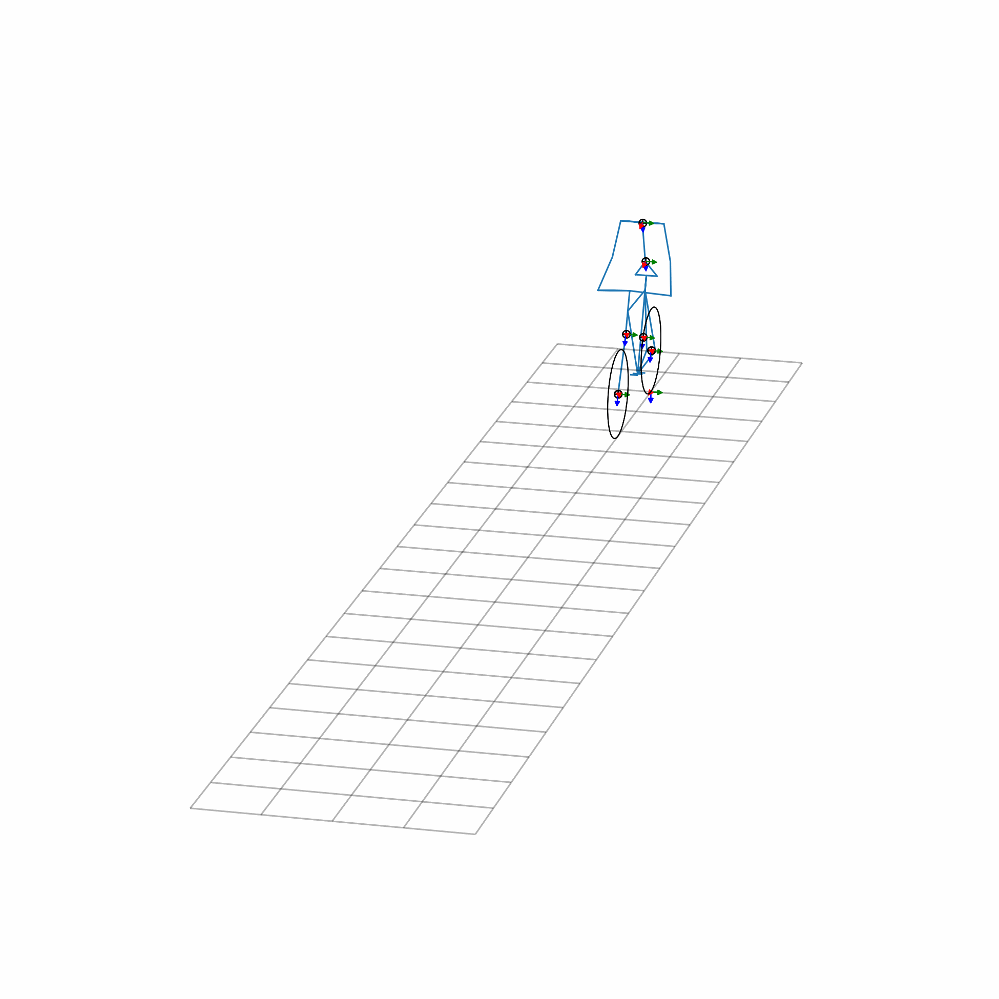

# Simulating an Upper-Body Bicycle-Rider Model
The model presented here combines the Whipple bicycle model following
[Moore's parametrization convention] with an upper body model. The connection between
the rear frame and the pelvis of the rider is established through pure side lean,
actuated by a torsional spring-damper. The arms of the upper body consist of two bodies:
the upper arm and the forearm. The shoulder is modeled as a spherical joint, while the
elbow is represented as a pin joint. Both joints are actuated using torsional
spring-dampers. Additionally, six holonomic constraints are employed to connect the
hands to the steer. The resulting model has a total of ten \gls{dof}, seven holonomic
constraints, four nonholonomic constraints, and is actuated by nine linear torsional
spring-dampers. The torque $T_i$ exerted by each spring-damper is defined as:

$$T_i(t) = -k_i(t) (q_i(t) - q_{eq,i}(t)) - c_i(t) \dot{q}_i(t)$$

where $k_i$ denotes the stiffness coefficient, $c_i$ the damping coefficient, $q_i$ the
joint angle and $q_{eq,i}$ the equilibrium angle. Each of these values is set by the
controller. The controller used in the forward simulation is simple, with constant
stiffness and damping coefficients. Also, the equilibrium angles of the spring-dampers
for shoulder abduction and rotation are set constant values. The equilibrium angle for
the side lean equals the opposite of the roll angle of the bicycle, such that the rider
stays upright. As for the shoulder and elbow flexion, those are controlled such that
they steer the bicycle towards the falling direction.

[Moore's parametrization convention]: http://moorepants.github.io/dissertation/eom.html
